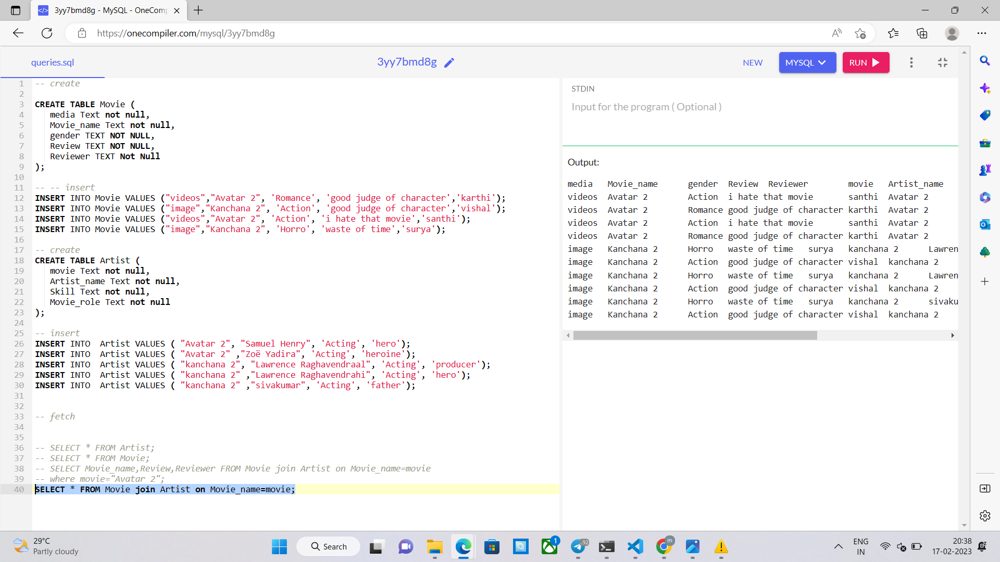
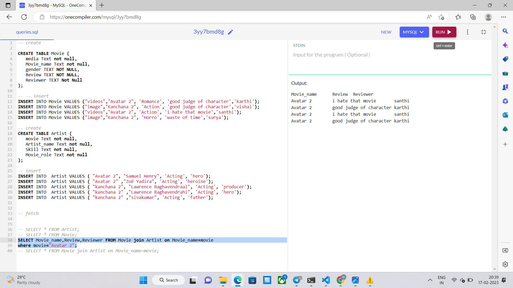

# day 35 Database - MySQL

### you can check the code by using some of the online mysql compiler

## MYSQL COMPILER => <a href="https://onecompiler.com/mysql" target="_blank">https://onecompiler.com/mysql</a>

## query 1

## query 2

